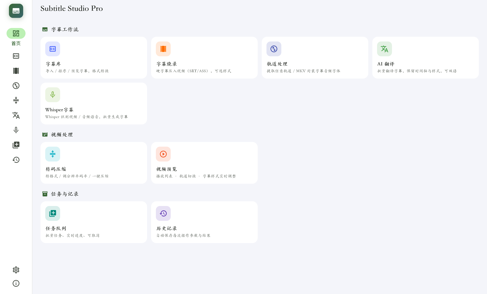
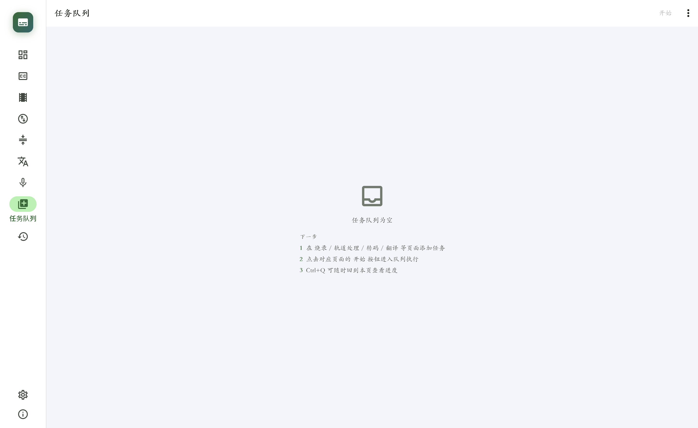
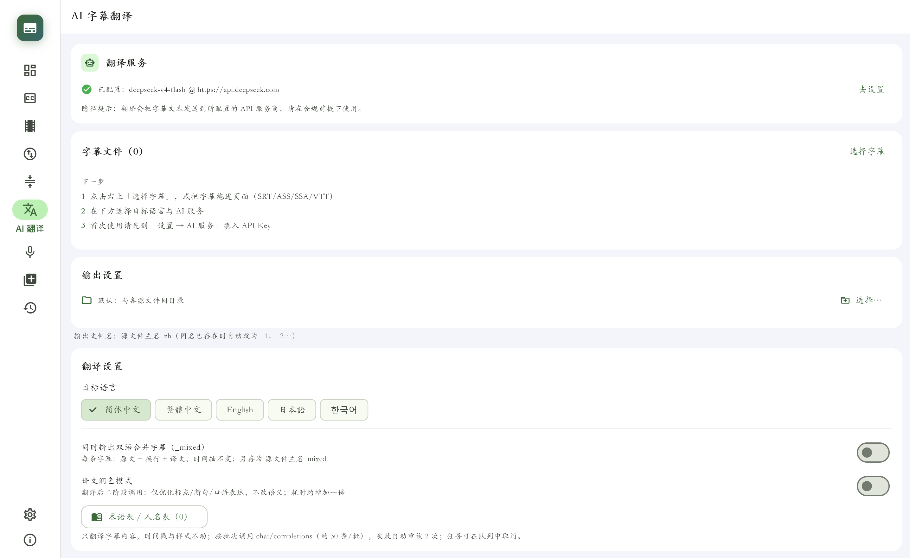
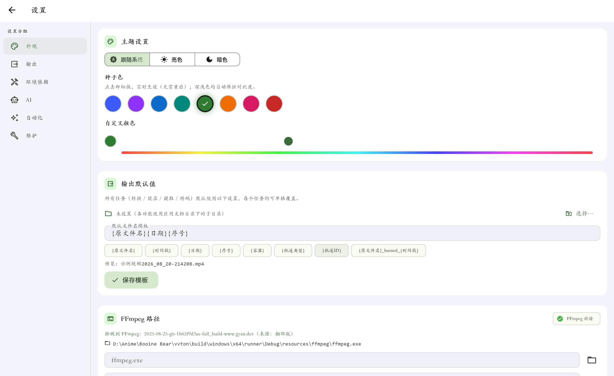
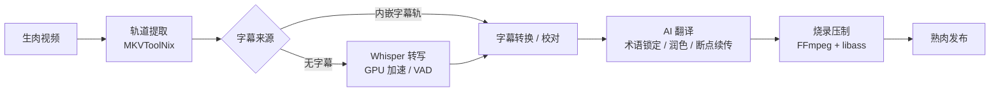

# Subtitle Studio Pro

**Windows 字幕组一站式桌面工具** —— 从生肉到熟肉：轨道提取、语音转写、AI 翻译、字幕烧录、批量压制，一条流水线全部搞定。

[](https://github.com/Elisoar111/sub-studio-pro/actions/workflows/ci.yml)
[](https://github.com/Elisoar111/sub-studio-pro/releases/latest)
[](https://github.com/Elisoar111/sub-studio-pro/releases)

[](https://flutter.dev)
[](LICENSE)

## 特性亮点

- **一条流水线** —— 提取、转写、翻译、字幕转换、烧录、转码、封装，七类任务进同一个队列，挂机跑完一整季
- **双车道调度** —— 网络任务（AI 翻译等）与本地任务（烧录 / 转码）并行执行，互不等待
- **AI 翻译面向字幕组场景优化** —— 术语锁定、断点续传、润色二阶段
- **隐私优先** —— 仅字幕文本发往你自配的 API 端点；除 AI 翻译与自动更新检查外无任何网络请求，无遥测、无崩溃上报
- **无人值守** —— 监视文件夹自动配对烧录、托盘常驻、自动更新

## 界面预览

| 主界面 | 任务队列 |
|:---:|:---:|
|  |  |
| **AI 翻译** | **设置（锚点导航）** |
|  |  |

## 下载安装

前往 **[Releases](https://github.com/Elisoar111/sub-studio-pro/releases/latest)** 下载最新版：

| 产物 | 说明 | 推荐场景 |
|---|---|---|
| `SubtitleStudioPro-x.x.x-setup.exe` | Inno Setup 安装包（内置 FFmpeg） | **日常使用**（关联 .srt/.ass/.ssa/.vtt、开始菜单、升级原地覆盖不丢历史） |
| `subtitle-studio-pro-x.x.x-portable.zip` | 便携版（同样内置 FFmpeg） | 免安装、U 盘随身 |

**系统要求**：Windows 10 / 11。应用内可自动检查更新，无需手动重下。

**校验完整性**：每个 Release 附带 `checksums.txt`（SHA-256），下载后可比对：

```powershell
Get-FileHash .\SubtitleStudioPro-x.x.x-setup.exe -Algorithm SHA256
```

## 工作流



全部环节进**统一任务队列**：网络任务（AI 翻译等）与本地任务（烧录 / 转码）双车道并行、车道内串行；支持取消、重试、失败详情与历史记录联动。

## 功能特性

<details open>
<summary><b>字幕处理</b></summary>

- **格式互转**：SRT / ASS / SSA / VTT / MicroDVD；GBK / BIG5 自动检测转 UTF-8；批量处理
- **烧录压制**：外挂字幕或内嵌轨直烧；ASS 特效全保留（libass）或统一样式预设（白字黑边 / 经典黄字 / 大字描边）；自动匹配同名字幕轨
- **轨道处理**：MKVToolNix 工具链——轨道提取（字幕 / 音频 / 视频 / 章节 / 字体附件）+ 封装（字体附件勾选带入）；非 MKV 容器无损转封后再提取
</details>

<details open>
<summary><b>AI 翻译</b></summary>

- OpenAI 兼容 API（自配 base URL / key / model）
- 术语表 `.glossary.json` sidecar 文件，人名 / 专名跨任务锁定；设置页自定义润色指令
- 批间上下文（携带前批尾部 3 条）、checkpoint 断点续传、润色二阶段、双语合并输出
</details>

<details open>
<summary><b>语音转写</b></summary>

- 三后端：openai-whisper / faster-whisper（推荐提速）/ whisper.cpp（实验）
- GPU 自动检测与推荐；VAD 静音过滤；`{episode}` 提示词模板；模型管理
</details>

<details open>
<summary><b>视频工具</b></summary>

- **转码压缩**：x264 / x265 / VP9 + NVENC / AMF / QSV 硬件编码；CRF / 分辨率 / 帧率 / 码率 / 音轨控制；参数预设管理
- **内置播放器**：mkv / Hi10P / FLAC 字幕组格式全覆盖（libmpv）；音轨字幕轨切换、字幕样式实时调整、时间轴偏移、快捷键
</details>

<details open>
<summary><b>自动化与基础设施</b></summary>

- **监视文件夹**：视频 + 同名字幕自动配对烧录，无人值守流水线，跨重启防重
- **系统托盘**：常驻后台、暂停 / 恢复队列、显示主窗
- **全局快捷键**、历史记录、输出路径 / 文件名模板、Material 3 多主题（亮 / 暗 / 种子色）、800×600~全屏自适应
</details>

## 环境依赖

外部工具通过子进程调用；查找优先级：**设置页自定义路径 → 捆绑 `resources/` → 系统 PATH**。安装包与便携版已内置 FFmpeg，其余按需安装。

| 工具 | 必需性 | 说明 |
|---|---|---|
| [FFmpeg](https://www.gyan.dev/ffmpeg/builds/)（full 版） | **必须** | 烧录 / 转码 / 提取；安装包已内置，自备环境需 full 版（含 libass，否则烧录报错） |
| [MKVToolNix](https://mkvtoolnix.download/) | 轨道处理需要 | 提取 / 封装；设置页可指定目录 |
| Whisper | 转写可选 | 三后端任选其一，见下表 |
| AI API Key | AI 翻译需要 | 任意 OpenAI 兼容端点，自配自管 |

**Whisper 三后端**（转写页自动检测已安装的后端）：

| 后端 | 安装方式 | 说明 |
|---|---|---|
| openai-whisper | `pip install -U openai-whisper` | 官方参考实现；CPU 可运行但较慢，GPU 提速需 CUDA |
| faster-whisper（推荐） | `pip install -U faster-whisper-ctranslate2` | CTranslate2 重写，速度约为官方版数倍 |
| whisper.cpp（实验） | 下载单文件 exe，设置页指定路径 | 纯 C++ 推理，无 Python 依赖 |

需 Python 3.9+（建议 3.10/3.11，用虚拟环境安装，避免 torch 与系统包冲突）；GPU 非必需。

## 快速上手

**普通用户**（详见[用户手册](docs/USER_MANUAL.md#3-快速上手第一条流水线)）：

1. 下载安装包（或便携版，见[下载安装](#下载安装)）
2. 安装 FFmpeg full 版（含 libass，烧录必需）—— [gyan.dev 构建](https://www.gyan.dev/ffmpeg/builds/)
3. （可选）按需安装 MKVToolNix（轨道处理）与 Whisper（语音转写），见[环境依赖](#环境依赖)
4. 启动应用 → 设置 → 环境依赖，确认工具已被识别（自动检测 PATH 与捆绑目录）
5. 拖入视频开始使用

**开发者**：

```bash
git clone https://github.com/Elisoar111/sub-studio-pro.git
cd sub-studio-pro
flutter pub get
# 仅当 windows/ 平台目录缺失时执行（已有项目勿重复运行，会覆盖平台文件）：
flutter create --platforms=windows --project-name=subtitle_studio_pro .
flutter run -d windows        # SDK 路径含空格时用 run_debug.bat（含 .plugin_symlinks 自愈）
flutter build windows         # 打包 Release
```

质量门禁（PR 前必须全绿）：

```bash
dart analyze
flutter test
```

## 常见问题

<details>
<summary><b>烧录时报「当前 FFmpeg 构建缺少 libass」？</b></summary>

安装含 libass 的完整版 FFmpeg（如 gyan.dev full 版），并在设置中指定其路径。
</details>

<details>
<summary><b>轨道处理页提示未检测到 MKVToolNix？</b></summary>

安装 MKVToolNix，或在设置 → 环境依赖中填写安装目录 / 使用「从安装目录导入」。
</details>

<details>
<summary><b>Whisper 检测很慢？</b></summary>

首次检测需启动 Python 子进程（torch 导入 10~30 秒）。检测结果已持久化缓存，下次启动秒级恢复。
</details>

<details>
<summary><b>AI 翻译会泄露我的字幕吗？</b></summary>

翻译时仅字幕文本发送到你自己配置的 API 端点（见[隐私声明](docs/PRIVACY.md)），音视频文件永远不外发。
</details>

<details>
<summary><b>关闭窗口后任务还在跑吗？</b></summary>

在。默认关闭最小化到系统托盘，任务后台继续；托盘菜单可暂停队列或真正退出。
</details>

<details>
<summary><b>升级新版本会丢历史记录吗？</b></summary>

不会。历史与设置存于用户文档目录，安装包升级原地覆盖程序文件。
</details>

## 项目结构

```
lib/
├── main.dart / app.dart              # 入口：窗口 + media_kit + Hive + 工具检测
├── core/                             # 常量 / Material 3 主题 / 工具函数
├── models/                           # 纯 Dart 数据模型（Subtitle / QueueTask / ...）
├── providers/app_providers.dart      # Riverpod：settings / history / preset / queue
├── screens/                          # 18 个页面（导航壳 + 各功能页）
└── services/
    ├── ffmpeg/                       # 子进程执行器（进度 / 取消 / 自定义路径）
    ├── mkvtoolnix/                   # mkvmerge / mkvextract 封装
    ├── ai/                           # OpenAI 兼容批量翻译（重试 / checkpoint / 润色）
    ├── whisper/                      # 三后端封装（GPU 检测 / VAD / 模板）
    ├── subtitle/                     # 解析 / 转换 / 编码检测（Isolate 并行）
    ├── queue_service.dart            # 双车道调度（网络 ∥ 本地）
    ├── watch_folder_service.dart     # 监视文件夹流水线
    ├── logging/                      # 崩溃捕获 + JSON Lines 日志轮转 + 调试包
    └── update/                       # GitHub Releases 自动更新
```

`test/` 覆盖服务层单测（翻译批次 / 断点续传 / 队列调度 / 字幕编码 / 自动更新）+ 页面布局回归（800×600 / 1024×700 / 1280×800 三档无溢出），当前状态见 [CI](https://github.com/Elisoar111/sub-studio-pro/actions/workflows/ci.yml)。

## 开发指南

- **TDD**：新行为先写失败的测试；服务层用注入缝（`chatOverride`、`gpuDetectOverride` 等）隔离外部进程 / 网络
- **布局回归**：UI 改动必须通过三档窗口布局测试
- **响应式工具状态**：外部工具相关 UI 一律 `ValueListenableBuilder` 监听可用性通知，禁止静态读取
- **发布**：质量门禁全绿 → 打 tag 触发 CI 自动构建并发布 Release（含 `checksums.txt`）

<details>
<summary><b>核心设计要点（架构细节）</b></summary>

- **字幕管线纯 Dart**：解析 / 转换 / 写出全在 Isolate 中进行；GBK / BIG5 / UTF-8 编码检测顺序 BOM → 严格 UTF-8 → GBK → BIG5 → Latin-1（严格校验先于宽容解码，否则 UTF-8 中文被 GBK 误吞）
- **AI 翻译批次管线**：30 cue/批、每批 2 次重试、术语表注入 system prompt、携带前批尾部 3 条上下文；checkpoint sidecar `.<输出名>.progress.json`（cue 数 + mtime + 语言三重校验）
- **输出命名统一**：内存 `used` 集合 + 磁盘双查去重，杜绝同批次模板撞名覆盖；提取扩展名遵循 gMKVExtractGUI v2.15 规则（AVC→`.avc`、HEVC→`.hevc`…）
- **进度与取消**：FFmpeg 走 `-progress pipe:1` 逐行解析（进度不回退去重）；取消 = 终止子进程；队列取消保留 checkpoint 供断点续传
</details>

<details>
<summary><b>Windows 常见坑（开发必读）</b></summary>

1. **滤镜路径转义**：`subtitles=`/`ass=` 里的盘符冒号、反斜杠、单引号必须转义，统一走 `escapeFilterPath()`
2. **libass**：烧录需要 gyan.dev full 版；报 `No such filter: subtitles` 即缺 libass
3. **`-map 0:s:N` 的 N 是流序号不是流索引**（提取内嵌字幕第一大坑）
4. **长路径**：Windows 默认 260 字符限制，深层目录建议启用 `LongPathsEnabled=1`
5. **进程取消**：`Process.kill()` 在 Windows 下是 TerminateProcess；应用退出时队列子进程随之终止（非守护）
6. **Whisper 检测慢**：torch 导入需 10~30s，检测放后台线程 + 结果缓存
</details>

## 文档

- [用户手册](docs/USER_MANUAL.md) —— 安装、环境依赖、各功能页使用与常见问题
- [隐私声明](docs/PRIVACY.md) —— 数据外发范围（仅 AI 翻译字幕文本与更新检查）

## 贡献

欢迎提交 issue 和 PR。提 PR 前：`dart analyze` 零问题 + `flutter test` 全绿，新行为先写测试。详见[贡献指南](CONTRIBUTING.md)。

## 致谢

本项目站在以下工具的肩膀上，请遵循各自协议使用：

- [FFmpeg](https://ffmpeg.org/) / [libass](https://github.com/libass/libass) —— 烧录压制与字幕渲染
- [MKVToolNix](https://mkvtoolnix.download/) —— 轨道提取与封装
- [OpenAI Whisper](https://github.com/openai/whisper) / [faster-whisper](https://github.com/SYSTRAN/faster-whisper) / [whisper.cpp](https://github.com/ggml-org/whisper.cpp) —— 语音转写三后端
- [Flutter](https://flutter.dev/) / [media_kit（libmpv）](https://github.com/media-kit/media-kit) —— UI 框架与内置播放器
- [gMKVExtractGUI](https://sourceforge.net/projects/gmkvextractgui/) —— 提取交互与扩展名规则的参照

## License

本项目源码采用 [MIT License](LICENSE) 开源，欢迎自由使用、修改与分发。

安装包 / 便携版中捆绑的外部工具（FFmpeg、MKVToolNix 等）版权归各自作者，遵循其原协议（FFmpeg LGPL/GPL、MKVToolNix GPL-2.0、Whisper MIT 等），详见[致谢](#致谢)。
